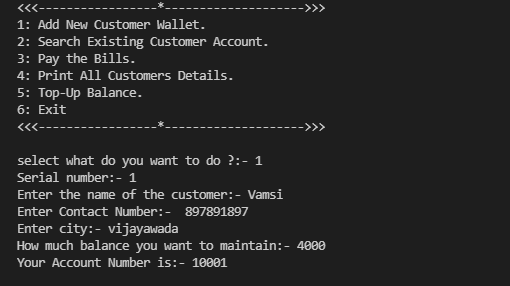
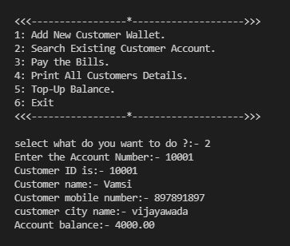
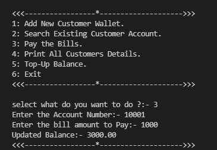
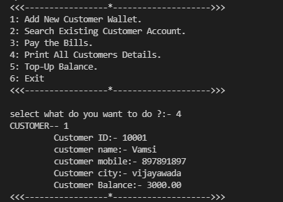
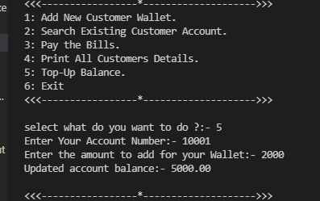

# Creating account for a New Customer

# Printing the information of a existing customer

# Paying the Bills

# Printing the information of all customers

# Adding balance to the customer's E-Wallet
